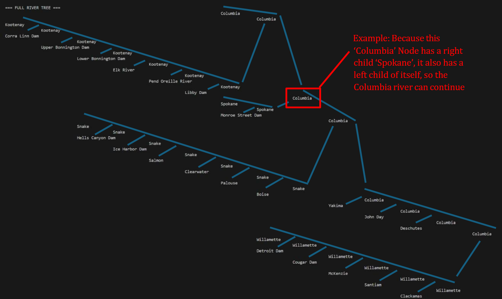

# Columbia River Binary Tree Project

---

This project models the Columbia River and its watershed using a binary tree structure implemented in C++. This was made as part of an assignment in my Algorithms and Data Structures class. The program allows for traversal of river features, addition of new tributaries and dams, and the output of key system information.

---
Example of printed tree, with lines added to help make format clear:

## Running the Program

### Compile and Run

To compile and run the main program:

1. Compile: `g++ main.cpp RiverTree.cpp -o program`
2. Run: `.\program.exe`

### Running Unit Tests

To compile and run the unit tests:

1. Compile: `g++ unit_test.cpp RiverTree.cpp -o test`
2. Run: `.\test.exe`

---

## System Design & Structure

The river system is modeled as a binary tree, where each RiverNode object stores either a tributary or a dam, but never both.

- Root Node: Represents the Columbia River's mouth and serves as the tree's entry point.
- Tributaries: Always branch to the right child node of their parent.
- River Continuation: The river continues along the path to the left child node (if a right node exists). This design makes the tree more like an actual river system while maintaining a binary tree structure.

---

## Program Features (Menu)

Users select their choice from the menu by typing a number from 1-5:

- View Full Tree (1): Prints the full tree, with the root furthest to the right and leaf nodes toward the left. This uses an in-order traversal for printing.
- Explore Tree (2): The user is presented one node at a time with all relevant information and can move from node to node along connections.
- Print All Dams (3): Lists every node whose name contains "Dam," along with the river each dam belongs to.
- Add Node (Interactive) (4): Allows the user to add a new node to the system by specifying the parent river, choosing whether to add a dam or a tributary, and entering the required details.
- Quit (5): Exits the program.

---

### Attributes Stored in Nodes

The project stores specific attributes for tributaries and dams:

| Node Type | Attributes Stored | Note |
| :--- | :--- | :--- |
| Tributary | Length, Basin Size, Discharge | Approximate values are used primarily to demonstrate information storage and display. |
| Dam | Relevant attributes (different from tributary info) | The design includes separate constructors for Dams and Tributaries because their required information differs. |

---
